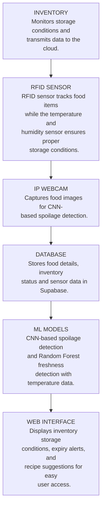

# Smart IoT-ML System for Food Monitoring

## Team Members

* **Sanggit Saaran K C S** (CB.SC.U4AIE23247)
* **Surya Ha** (CB.SC.U4AIE23267)
* **Vishal Seshadri B** (CB.SC.U4AIE23260)
* **Venkatram K S** (CB.SC.U4AIE23236)

---

## Project Overview

This project presents an intelligent food monitoring system that integrates **IoT sensors** and **Machine Learning** to optimize food storage, classification, and usage. The primary objective is to ensure **food safety**, enhance **storage management**, and reduce **food wastage** using real-time data and predictive analytics.

---

## Objectives

* Efficiently monitor and classify food items using sensor data and ML models.
* Maintain optimal storage conditions by monitoring **temperature and humidity**.
* Reduce food wastage by predicting **expiration dates** and suggesting recipes based on **available ingredients**.

---

## System Architecture



### Key Components:

* **IoT Sensors**:

  * **RFID** for food item identification and stock tracking
  * **DHT22** for monitoring **temperature** and **humidity**

* **Hardware**:

  * **ESP32** microcontroller
  * **IP Webcam** for real-time image capture

* **ML Models**:

  * **MobileNetV2 (CNN)**: Lightweight deep learning model for food image feature extraction
  * **Support Vector Machine (SVM)**: For classification of food types and freshness
  * **Random Forest**: Predicts food expiration based on environmental and visual data

* **LLM Integration**:

  * A **recipe generator** module that suggests meal ideas using available ingredients, prioritizing items near expiration.

---

## Features

* ✅ Real-time food monitoring with IoT sensors
* ✅ Smart food classification using CNN + SVM
* ✅ Expiry prediction with Random Forest
* ✅ Temperature & humidity regulation via DHT22
* ✅ Recipe suggestions powered by LLM for sustainability

---

## 🧠 Machine Learning Models

We use pre-trained `.pkl` models for freshness detection and classification.

### 🔗 Download `.pkl` Model Files

Get all required model files from the following Google Drive link:

📂 **[Download Model Files (.pkl)](https://drive.google.com/drive/folders/1604KjtqgklhdLasJK6XrEO4D7VeBrUqS?usp=sharing)**

> After downloading, **create a folder** named `models` inside `backend/vision/` and place the `.pkl` files there.

---

## 🍎 Dataset

This project originally used a large fruits and vegetables dataset, which is **not included** in the repository due to size limits.

Download it manually from:

🔗 **[Kaggle – Fruits & Vegetables Dataset (12,000)](https://www.kaggle.com/datasets/muhriddinmuxiddinov/fruits-and-vegetables-dataset)**

> After downloading, extract and place the dataset folder inside:
> `backend/vision/models/Fruits_Vegetables_Dataset(12000)/`

---

## 🚀 Getting Started

### 🔌 Hardware Setup

* ESP32 with:

  * MFRC522 RFID Module (SPI)
  * DHT22 Sensor (GPIO)
* Power supply + serial connection

### 🧪 Backend (Flask)

```bash
cd backend/vision
pip install -r ../../requirements.txt
python app.py  # Runs on http://127.0.0.1:5002
```

Make sure the models folder and all required files exist before running the server.

---

### 🚀 Frontend (React)

```bash
cd frontend
npm install
npm run dev  # Runs on http://localhost:5173
```

---

## Result & Conclusion

The integrated Smart IoT-ML system demonstrated:

* Accurate classification of food types and freshness
* Reliable environmental monitoring to ensure food quality
* Effective recipe generation that minimizes wastage by prioritizing near-expiry items

This project offers a **scalable, efficient, and intelligent solution** for smart kitchen management, contributing to food sustainability and smarter household inventory systems.

---

